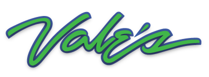

  

<strong>SEED</strong>

VALES Seed is the part of VALES I can give away.

It contains the symbols, language, and structure behind the larger archive. This is starting material, not the finished thing. Copy it, change it, or use it to grow something I would not have made.

`core/` · `lexicon/` · `grammar/` · `archive/` · `emissary/`
